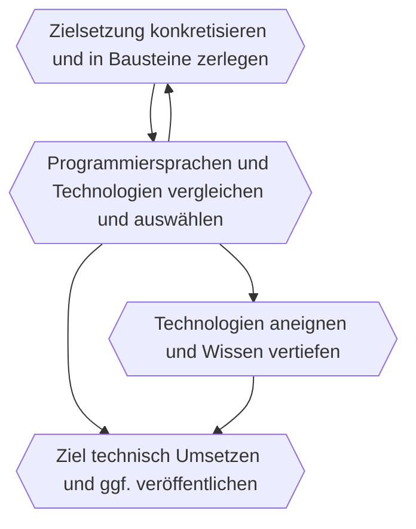

In vielen Köpfen sind Informatik und IT noch ein Nischenthema für Spielkinder,
dabei ist das Thema inzwischen in verschiedenste Berufsfelder und Lebensbereiche fest integriert.
Jüngere Strömungen der Philosophie sehen Informatik und Mathematik inzwischen nicht mehr als Gegenmodell zu den Geisteswissenschaften,
sondern integrieren sie oder nutzen sie sogar als theoretische Grundlage.
Viele Frauen und Mädchen kommen erst gar nicht auf die Idee, dass Informatik ihnen berufliche Perspektiven eröffnen könnte,
weil die damit gewachsene Subkultur sie nicht anspricht.
Mit IT-Kenntnissen können sie inzwischen überall mitarbeiten und sich einbringen:
Medizin, Sprachforschung, Klimaforschung, Produktentwicklung, Spiele, Kommunikation, Verwaltungswesen,
Medien und Archiv, Sport/Fitness, Barrierefreiheit uvm.
Sie sind nicht „im sozialen Abseits“, sondern mitten im Geschehen und können aktiv gestalten und Entscheidungen beeinflussen,
statt nur in der Anwenderposition Arbeiten auszuführen.
Die Entscheidungen und Entwicklungen wirken auf uns als Gesellschaft zurück, daher sollten wir das Gebiet nicht nur einer Hälfte der Bevölkerung überlassen.
Es gibt insgesamt sehr wenig gute Didaktik zum Thema und noch seltener in einer Form, die Frauen anspricht.
In meinem Anfängerkurs mit ca 10 Sitzungen erhalten die Teilnehmerinnen eine Einführung zum Programmieren lernen, Grundbegriffe der Informatik und berufliche Perspektiven.
Themenschwerpunkte und Durchführungsmodalitäten (online, Präsenz, Teilnehmerzahl) können flexibel gestaltet werden.

### Aufgabenbezug

> Sprechen ist kein Selbstzweck, sondern wir müssen sprechen können, um etwas ausdrücken zu können.

Programmieren beginnt mit einer konkreten Zielsetzung und dem Drang, etwas zu erschaffen.
Das folgende Prozessmodell veranschaulicht die Schritte, die man dabei durchlaufen kann:

<figure>
<figcaption>Prozessmodell für Programmierprojekte</figcaption>

</figure>

Dieser Prozess wird ein Leben lang an vielen verschiedenen Aufgaben geübt und mental gefestigt.
So erweitert sich mit der Zeit das Wissen und die Schritte laufen immer flüssiger ab.
Alle Profis haben mit irgendeiner Aufgabe angefangen und die ersten Versuche sind immer unbeholfen.
Mein Kurs vermittelt diese kognitive Strategie durch alltagsnahe Aufgaben, die sich mit möglichst geringen technischen Hürden umsetzen lassen.
Die Teilnehmerinnen sind damit in der Lage, sich selbstständig auf ihrem Interessensgebiet weiterzuentwickeln.

### Genutzte Technologien

Die genutzten Technologien bilden einen Kompromiss von geringen Einstiegshürden und flexiblen Einsatzmöglichkeiten.

- [Typst] zur Erstellung ansprechender Dokumente mittels Programmierung
- [Kotlin] als Programmiersprache zum Umsetzen erster Alltagsaufgaben, auch für die Entwicklung mobiler Apps geeignet
- [IntelliJ Idea] als Arbeitsumgebung

[kotlin]: https://kotlinlang.org/
[intellij idea]: https://www.jetbrains.com/idea/
[typst]: https://typst.app/
